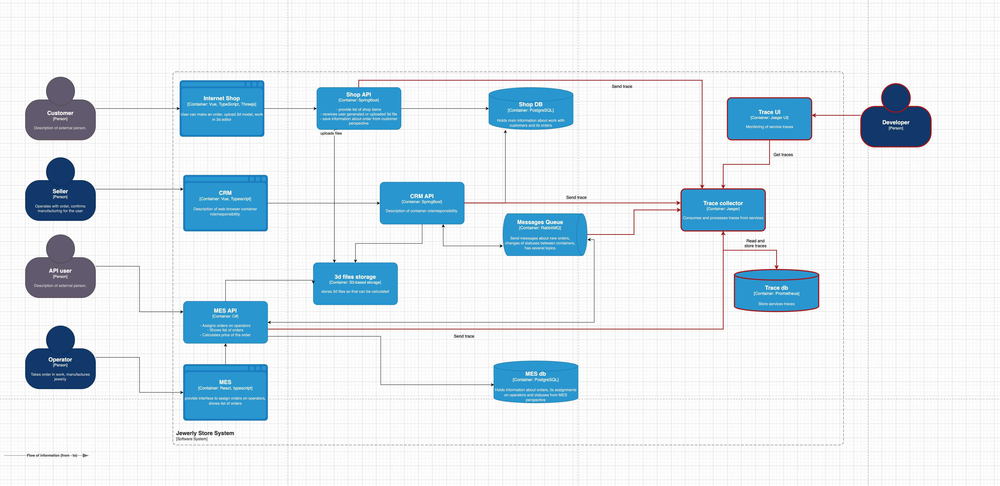

## Мотивация

Трейсинг позволяет отслеживать каждый шаг обработки заказа и выявлять узкие места, где процесс может "сломаться" или зависнуть. Это снизит риски сбоев, ускорит устранение проблем и улучшит пользовательский опыт, что напрямую влияет на лояльность клиентов и эффективность работы компании.

Что даст трейсинг компании?
1. Быстрое обнаружение проблем: Трейсинг покажет, где именно возник сбой — в интеграции, обработке заказа или хранилище файлов.Бизнес-эффект: Меньше отменённых заказов.
2. Сокращение времени простоя: Меньше времени на поиск и устранение ошибок. Бизнес-эффект: больше завершённых заказов.
3. Повышение прозрачности процессов: Легче понять, как работает система, и избежать повторяющихся ошибок. Бизнес-эффект: меньше ошибок, быстрее разработка.

Трейсинг — это не только про стабильность системы, но и про уверенность клиентов, что их заказы в надёжных руках.

## Анализ системы - проблемные места для трассировки

1. Пользователь создал заказ, он сохранился в базе - Shop API -> Shop DB. Статус INITIATED, SUBMITTED
2. Загрузка файл c 3d моделью. Надо проверить что загрузка прошла успешно, что файл корректный - трассируем S3. Статус FILE_UPLOADED
3. Заказ может не посчитаться в MES системе. Надо проверить как отрабатывает MES система. Статус PRICE_CALCULATED
4. После надо проверить что заказ ушел на производтсво в CRM систему и прошел там все этапы, включаю отправку и подтверждение
5. В трассировку надо включить и работу с очередью - RabbitMQ. Нало убедиться, что сообщения там не пропадают, не подвисают.

## Предлагаемое решение

Для реализации трейсинга мы возьмем технологии OpenTelemetry (OTel), Jaeger. Для внедрения нам потребуется доработать сервисы - внедрить туда sdk OTel которое будет отправлять необходимы данные в примники, затем в коллектор данных, где они агрегируются, а дальше на UI и базу.

## Компромисы 

Трейсинг не принесёт пользы или будет слишком дорог в следующих случаях:

1. Малый объём операций: Если заказов мало, проблемы проще выявить вручную.
2. Монолитная архитектура: Внутри монолита трейсинг даёт мало пользы, так как вызовы не распределены.
3. Отсутствие сложных интеграций: Если система почти не использует внешние API или очереди, трейсинг избыточен.
4. Ограниченный бюджет: Инфраструктура трейсинга требует затрат на настройку, обучение команды и ресурсы.

## Безопастность

Для предотвращения несанкционированного доступа к системе трейсинга будут предусмотрены следующие меры:

1. Аутентификация и авторизация:
 - Доступ к трейсинг-системе (Jaeger/OpenTelemetry) возможен только по учетным записям сотрудников с актуальными данными.
 - Доступ ограничивается ролями (например, только "Поддержка" или "DevOps" могут видеть трейсинг-данные).
2. Сетевые ограничения:
 - Система трейсинга будет доступна только из корпоративной сети или через VPN.
 - Использование брандмауэров для ограничения доступа извне.
3. Шифрование:
 - Все данные и соединения будут передаваться с использованием TLS (HTTPS) для защиты от перехвата.
4. Логи и аудит:
 - Логирование всех попыток доступа, включая успешные и неуспешные попытки.
 - Настройка уведомлений об аномальных действиях (например, массовые запросы или попытки брутфорса).

