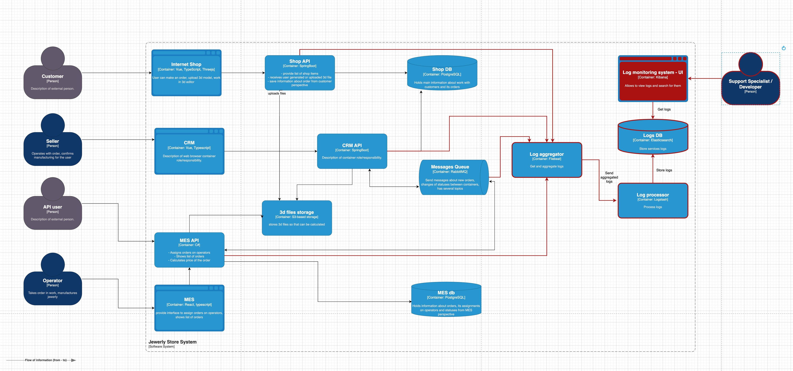

## Анализ системы

Логи нужно собирать из API сервисов, из сервисов MES, CRM, баз данных, а так же с очереди событий.

Уровни логирования и их применение:
- INFO: Для стандартных операций (изменение статуса, успешные API-запросы, обработка файлов).
- DEBUG: Для отладки (например, параметры запросов, внутренние данные в процессе). Используется только в режиме разработки.
- ERROR: Для ошибок (таймауты, сбои в API, недоставленные сообщения).
- WARN: Для потенциальных проблем (высокая задержка, близкие к пределам ресурсы).

Логи уровня INFO

1. Изменение статуса заказа:
 - Время изменения.
 - Идентификатор покупателя.
 - Номер заказа.
 - Новый статус.
 - Система, инициировавшая изменение (e.g., CRM, MES).
2. Обработка 3D-файлов:
 - Время начала и окончания обработки.
 - Идентификатор файла.
 - Результат обработки (успешно/ошибка).
 - Время обработки.
3. Взаимодействие через API:
 - Время запроса.
 - URL и метод API (GET, POST и т.д.).
 - Код ответа (200, 500 и т.д.).
 - Уникальный trace-id для запроса.
4. Сообщения в очередях (RabbitMQ):
 - Время отправки/получения сообщения.
 - Уникальный идентификатор заказа.
5. Запись в базы данных (Shop DB, MES DB):
 - Время записи.
 - Тип операции (CREATE, UPDATE, DELETE).
 - Таблица и затронутые поля.

## Мотивация

### Что даёт логирование компании:

1. Прозрачность работы системы: Логирование позволяет видеть, как выполняются заказы, где происходят сбои, и как взаимодействуют сервисы.
2. Быстрая диагностика проблем: Сокращается время поиска и устранения ошибок, что минимизирует простой системы и потери клиентов.
3. Повышение качества обслуживания: Логи помогают выявить узкие места, улучшить производительность и сократить задержки в обработке заказов.

### Метрики, на которые влияет логирование:

1. Время восстановления системы (MTTR): Быстрое выявление и исправление ошибок сокращает время простоя.
2. Процент успешных заказов: Логи помогают анализировать причины сбоев и повышать надёжность выполнения заказов.
3. Время обработки заказов: Анализ логов позволяет оптимизировать процессы и уменьшить задержки.
4. Удовлетворённость клиентов: Меньше ошибок и задержек повышают доверие и лояльность клиентов.
5. Операционные расходы: Автоматизированный анализ логов снижает затраты на ручную диагностику.

## Предлагаемое решение

Для реализации мы возьмем ELK стек, он объединяет четыре инструмента: агент доставки данных FileBeats, конвейер данных Logstach, базу данных Elasticsearch и инструмент визуализации Kibana.

[Схема C4 логирование](C4_jewerly_logs.drawio)

### Политика безопасности и хранения логов

1. Сбор и фильтрация чувствительных данных:
 - Логи не должны содержать пароли, персональные данные клиентов (ФИО, адреса, номера телефонов) или платежную информацию (номера карт).
 - Маскирование чувствительных данных (e.g., последние 4 цифры номера карты).
 - Использование Data Loss Prevention (DLP) инструментов для автоматического контроля за утечкой данных.
2. Доступ к логам:
 - Ролевой доступ:
   - Полный доступ — только для DevOps, инженеров безопасности и старших разработчиков.
   - Ограниченный доступ — для поддержки и менеджеров, только к агрегированным данным (без детализированных событий).
3. Шифрование логов:
 - Логи хранятся только в зашифрованном виде (напр., AES-256).
 - Все соединения при передаче логов защищены TLS (HTTPS).
4. Мониторинг и аудит доступа:
 - Логируются все попытки доступа к системе логов (включая успешные и неуспешные).
 - Регулярный аудит доступа к логам, с уведомлениями о подозрительных действиях (например, массовая выгрузка логов).
5. Срок хранения:
 - Логи с чувствительными данными (если они сохраняются) удаляются через 30 дней.
 - Обычные логи хранятся до 6 месяцев или дольше, если требуется по регуляторным нормам.
5. Разделение окружений:
Логи тестовых и продакшен-систем хранятся отдельно.
Продакшен-логи доступны только сотрудникам, работающим с этим окружением.

### Мероприятия для превращения системы сбора логов в систему анализа логов:

1. Настройка алертинга:
 - Настроить автоматические уведомления при следующих событиях:
   - Увеличение числа ошибок (например, ERROR-логов) выше определённого порога.
   - Таймауты или сбои в ключевых API-запросах (e.g., интеграции с CRM или MES).
   - Необычные задержки в обработке заказов или взаимодействии с очередью RabbitMQ.
2. Поиск аномалий:
 - Выявление резкого роста или снижения активности:
   - Резкий рост числа заказов (возможный DDoS или боты).
   - Аномально большое количество запросов к API за короткий промежуток времени.
   - Необычная активность, связанная с изменением статусов заказов или обработкой файлов.

#### Потенциальные сценарии аномалий:

1. DDoS-атака: 10 000+ запросов в секунду к API или сервису заказов.
   Реакция: временно блокировать IP через WAF, уведомить команду безопасности.
2. Рост ошибок: Резкое увеличение 500 Internal Server Error из одного компонента.
   Реакция: выделить инженера для диагностики.
3. Низкая активность: Внезапное отсутствие заказов в пиковое время.
   Реакция: проверить API-магазина и интернет-соединение.

