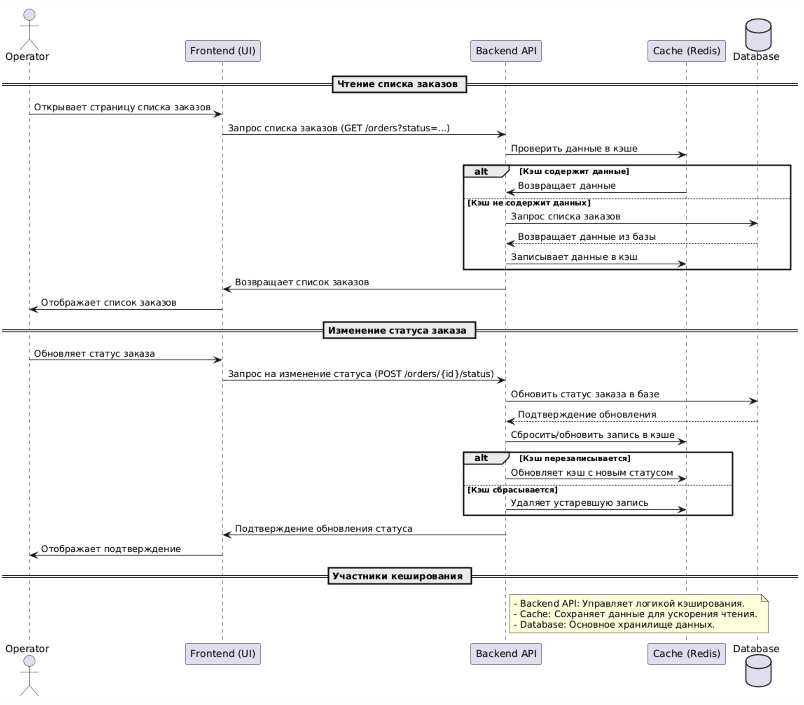

## Анализ системы

Сейчас существует проблема долгой загрузки первой страницы MES системы с заказами. Операторам важно быстро видеть заказ в новом стутсе, например в MANUFACTURING_APPROVED, чтобы скорее отдать на производство. При этом заказ может продолжительное время находиться в одном статусе и каждый раз запрашивать его актульное значение из БД долго. 
Для начала нужно будет закешировать **MES DB**

## Мотивация

Внедрение кэшировани в MES систему(точнее кэшируем запросы к MES DB) решит ряд наших проблем:
1. Медленна загрзку страницы с заказами. Причина тут долгие запросы в базе данных, причем запросы могут возвращать один и тот же ответ, что может быть избыточно. Кэширование за счет хранения заказов в быстрой памяти, ускорит процесс.
2. Актуальность данных. Выбрав правильную стратегию кэширования, мы поддержим баланс между актуальностью данных и скорости загрузки.
3. Масштабируемость. Уменьшение нагрузки на БД. При росте кол-ва заказов, мы защитим нашу базу данных от избыточных запросов, которое может привести к деградации системы и увеличении стоимости.
   
## Предлагаемое решение

### Клиенское vs серверное кэширование

В данном случае выбираем серверное кэширование т.к.
1. Клиенское кэширование хорошо работает для статичных ответов, у нас же меняеющийся по статусам заказ, из-за этого у нас есть риск увидеть устаревшую информацию
2. Делает систему более предсказуемой, операторы будут в равных условиях, т.к. для всех время кэша и его логика одинаковы
3. Мы представляем внешнее публичное API. И никто не гарантирует его правильное использование с правильными загаловками кэширования.

### Выбор паттерна

| **Паттерн**      | **Плюсы**                                                                 | **Минусы**                                                                                           |
|-------------------|---------------------------------------------------------------------------|-----------------------------------------------------------------------------------------------------|
| **Cache-Aside**   | - Простая реализация.  - Кэш заполняется только востребованными данными.  - Позволяет гибко управлять TTL. | - Первая загрузка может быть медленной (кэш «холодный»).  - Актуальность зависит от TTL или ручного сброса. |
| **Write-Through** | - Кэш всегда содержит актуальные данные.  - Удобен для часто обновляемых данных. | - Увеличивает время записи, так как данные пишутся и в базу, и в кэш.  - Сложнее реализовать. |
| **Refresh-Ahead** | - Актуальные данные доступны заранее.  - Подходит для прогнозируемых запросов (e.g., популярные страницы). | - Может кэшировать ненужные данные.  - Требует грамотной настройки для предотвращения избыточной нагрузки. |
| **Read-Through**  | - Прозрачный для приложения: кэш сам обращается к базе.  - Простота использования для популярных фреймворков. | - Может стать «узким местом», если нагрузка на кэш-сервер возрастает. |

**Итоговый выбор: Cache-Aside**

**Почему:**
- **Гибкость**: Паттерн позволяет кэшировать только нужные данные (например, текущие заказы по статусам).  
- **Простота реализации**: Подходит для большинства сценариев MES, где кэш обновляется по мере запросов операторов.  
- **Оптимизация ресурсов**: Нет необходимости кэшировать ненужные данные, что снижает избыточное использование памяти.

**Как будет работать:**
1. При запросе заказов проверяется кэш:
   - Если данные есть, они возвращаются из кэша.  
   - Если данных нет (кэш «холодный»), они запрашиваются из базы, затем записываются в кэш.  
2. Обновление кэша происходит вручную:
   - Например, сброс данных при изменении статусов заказов в базе или по истечении TTL.  

### Диаграмма последователности работы кэша:

[Диаграмма работы кэша](cache.puml)